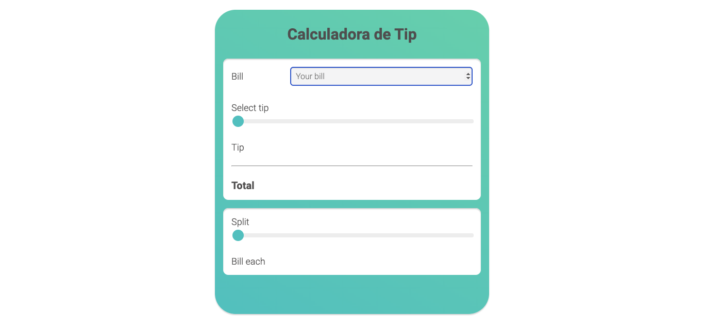

# Tip Calculator Project

## Table of Contents

- [Tip Calculator Project](#tip-calculator-project)
  - [Table of Contents](#table-of-contents)
  - [Overview](#overview)
  - [Project Details](#project-details)
  - [Description](#description)
  - [Key Features](#key-features)
  - [Lessons Learned](#lessons-learned)
  - [Future Enhancements](#future-enhancements)
  - [Contact Information](#contact-information)

## Overview

Hello! I'm Lucas de Lacerda, and I'm excited to introduce my Tip Calculator project, where I brought together the power of HTML, JavaScript, and CSS to create a functional and visually appealing application. This project showcases my skills in web development, ranging from crafting user interfaces to implementing interactive features.

## Project Details

- **Project Name:** Tip Calculator
- **Technologies Used:** HTML, JavaScript, CSS
- **Date Completed:** [Insert completion date]

## Description

The Tip Calculator is a user-friendly web application that allows users to quickly and conveniently calculate the appropriate tip amount for a given bill, including the option to split the total among multiple people. By utilizing HTML for structure, CSS for styling, and JavaScript for dynamic functionality, I've developed an application that enhances the user experience and simplifies the process of calculating tips and splitting expenses among friends.

## Key Features

- **User-friendly Interface:** The project features an intuitive and visually pleasing interface, ensuring a seamless user experience.

- **Bill Amount Input:** Users can effortlessly input the total bill amount using a responsive input field.

- **Tip Percentage Selection:** A variety of tip percentage options are provided, enabling users to choose their desired tip rate based on their preferences.

- **Splitting among People:** In addition to tip calculation, users can opt to split the total bill, including the tip, among multiple individuals.

- **Real-time Calculation:** As users input the bill amount, select the tip percentage, and specify the number of people for splitting, the application instantly calculates and displays individual tip amounts and total bills for each person.

- **Dynamic Styling:** CSS is leveraged to enhance the visual appeal of the application, making it more engaging and user-friendly.

## Lessons Learned

This project taught me how to effectively integrate HTML, JavaScript, and CSS to create a fully functional web application. I gained insights into handling user input, performing calculations, and dynamically updating the interface. Through this project, I not only honed my technical skills but also gained practical experience in designing and developing interactive web applications.

## Future Enhancements

I plan to continue refining and expanding this project by adding more features, such as currency formatting options, customizable tip percentages, and a responsive interface for various devices.

## Contact Information

Feel free to contact me through [email](lacerdalucas27@gmail.com) to discuss this project or any other opportunities. You can also find me on [LinkedIn](https://www.linkedin.com/in/lucas-lacerda-066316186/) for further details about my projects and experience.

Thank you for considering my Tip Calculator project!
# tipCalculator
